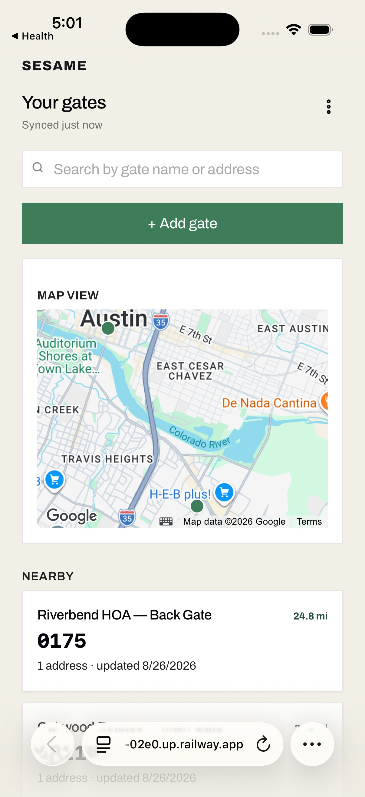
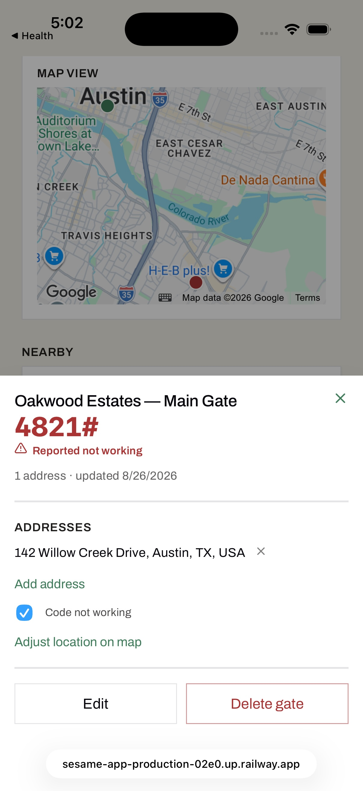
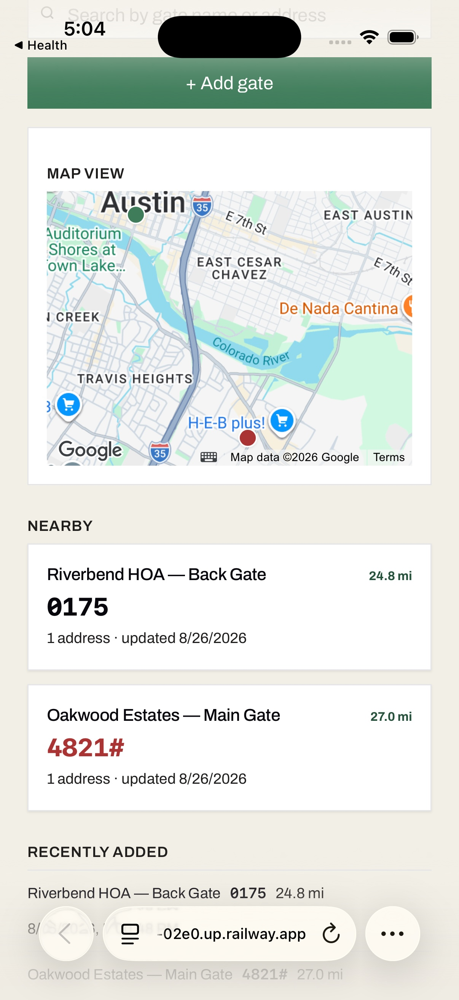

# Sesame

Sesame is a mobile app for saving gate codes at gated communities, so you're not screenshotting
codes and scrolling your camera roll trying to find the right one while you're stuck at a call
box. Save a code once, standing at the gate, and next time you're back it just shows up. The
app knows where you are and puts the right code at the top of the list.

**Try it:** https://sesame-app-production-02e0.up.railway.app



## Getting started

1. Open the link above on your phone and log in (or register if it's your first time).
2. Add your first gate: give it a name, type in the code, and hit save. Standing at the gate
   when you do this lets the app grab your location automatically, which is what makes it show
   up later.
3. That's it. Next time you're near that gate, it's the top result on your home screen.

On iPhone, use Share → Add to Home Screen in Safari to install it like a real app. It'll work
offline after that (except the map, see below).

## How to use it

**Saving a gate.** Tap "+ Add gate," type the name and code, save. If you know the address you
can type it in too (there's autocomplete to help) and optionally use that address's location to
place the pin instead of your current GPS location, handy if you're adding a gate after the
fact rather than standing at it.

**Finding a code.** The list on the home screen is always sorted by distance, nearest first, and
it's never filtered. Every gate you've saved shows up, because you might need a gate a mile away
just as easily as the one you're standing at. You can also search by gate name or address if
you'd rather type than scroll.

**A code stopped working?** Open the gate and check "Code not working." It shows up as a red
warning wherever that gate appears (the list, the map, the gate's own page), so you know at a
glance before you drive over there. The next time you update the code, the flag clears itself
automatically.



**The map.** Tap into the map view to see all your gates as pins. Tap a pin to preview it,
long-press anywhere to drop a new gate at that spot, or drag an existing pin if it's a little off.
The map needs an internet connection to work. Everything else in the app doesn't.

**One gate, many addresses.** If a community has forty houses behind one gate, you only need to
save the code once. Add each address under that same gate instead of re-saving the code forty
times. That way, when the community changes the code, you only have to update it in one place.



**Offline.** Everything works without a signal except the map. Codes you've already saved are
always there, and you can add new gates offline too. They'll sync up next time you're connected.

## For developers

React + TypeScript + Vite frontend (installable PWA), Node + Fastify backend, Postgres with raw
SQL (no ORM), argon2id auth with server-side sessions. The map uses the Google Maps JS API and
needs an API key (see `.env.example`).

```bash
npm install

# copy .env.example to .env first if you want maps/autocomplete to work locally,
# otherwise it'll just render without them, everything else still works fine
npm run dev

# needs DATABASE_URL pointing at a local Postgres
npm run dev:server
```

```bash
npm test                 # unit + component tests
npm run test:integration # spins up Postgres in a container
npm run test:e2e         # Playwright, also spins up its own throwaway Postgres
```

## Things this doesn't do

No geocoding random addresses, no turn-by-turn directions. The map's just for looking at and
placing pins. No sharing codes with other users and no public database of gate codes floating
around. This is just for one person's own deliveries, nothing crowdsourced.
